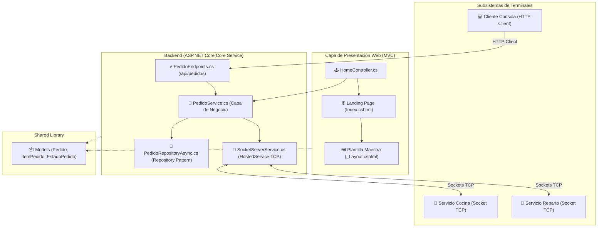

# 🏛️ Documentación de Arquitectura y Estructura del Proyecto

**Proyecto:** PSR-MinimalAPI  
**Sistema:** Gestión de Pizzería Artesanal  
**Framework:** .NET 10 (ASP.NET Core MVC + Minimal APIs)  

---

## 📌 1. Visión General de la Arquitectura

El sistema **PSR-MinimalAPI** utiliza una arquitectura distribuida por subsistemas desacoplados, combinando:
1. **Peticiones Síncronas (HTTP REST & MVC Razor Views)**: Para la navegación web del usuario, visualización de la Landing Page y gestión de pedidos.
2. **Eventos Asíncronos en Tiempo Real (Sockets TCP)**: Para la comunicación entre el Backend y los subsistemas físicos de `Cocina` y `Reparto`.
3. **Patrón Repository Asíncrono & Capa de Servicios**: Para el desacoplamiento de reglas de negocio y acceso a datos de forma asíncrona (`async/await`).

---

## 📐 2. Diagrama de Componentes



---

## 📦 3. Estructura de Proyectos de la Solución

| Proyecto / Carpeta | Tipo | Descripción |
| :--- | :--- | :--- |
| **`Backend/`** | Web API & MVC | Proyecto principal que aloja la Landing Page MVC, Minimal APIs, Repositorios asíncronos y Servidor TCP Socket. |
| **`Backend/Controllers/`** | MVC Controllers | Aloja `HomeController.cs` que hereda de `Controller` y sirve las vistas Razor. |
| **`Backend/Views/`** | Razor Views | Aloja la vista principal `Home/Index.cshtml` y la plantilla global `Shared/_Layout.cshtml`. |
| **`Backend/wwwroot/`** | Archivos Estáticos | Aloja la hoja de estilos `css/landing.css`, imágenes y recursos públicos. |
| **`Backend/Repositories/`** | Acceso a Datos | Implementación del patrón Repository (`IPedidoRepositoryAsync`, `PedidoRepositoryAsync`). |
| **`Backend/Services/`** | Capa de Negocio | Implementación de las reglas de negocio (`IPedidoService`, `PedidoService`). |
| **`Shared/`** | Class Library | Entidades del dominio compartidas (`Pedido`, `ItemPedido`, `EstadoPedido`). |
| **`Cliente/`** | Console App | Terminal interactiva de comandos para clientes. |
| **`Cocina/`** | Service App | Subsistema de cocina que recibe pedidos por Sockets TCP y actualiza su estado. |
| **`Reparto/`** | Service App | Subsistema de reparto que recibe pedidos listos y gestiona la entrega. |

---

## ⚙️ 4. Flujo de Datos

```
[Usuario Web] ➔ HomeController.Index() ➔ Views/Home/Index.cshtml + _Layout.cshtml
                                             │
                                             ▼
                                  [Hacer Pedido (CTA)]
                                             │
                                             ▼
                                     PedidoService.cs
                                             │
                       ┌─────────────────────┴─────────────────────┐
                       ▼                                           ▼
             PedidoRepositoryAsync.cs                     SocketServerService.cs
           (Persistencia en Memoria)                     (Notificación a Cocina TCP)
```
